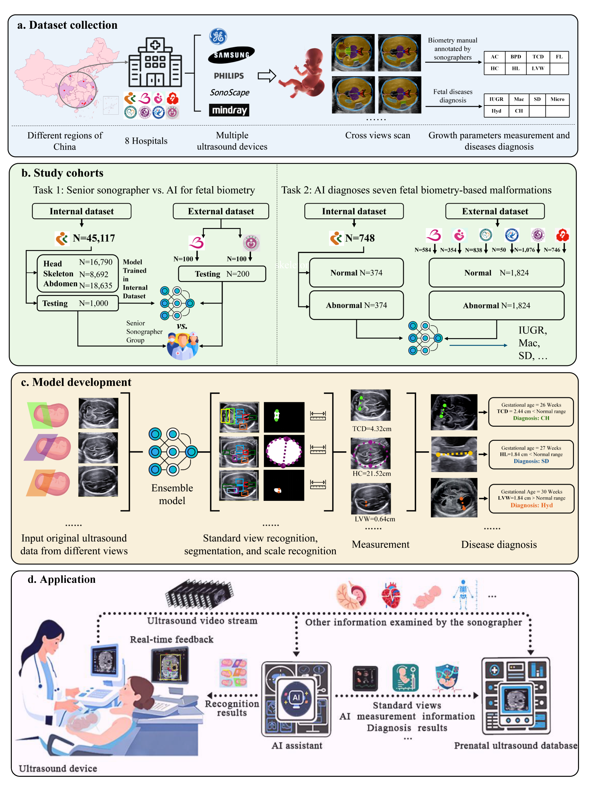
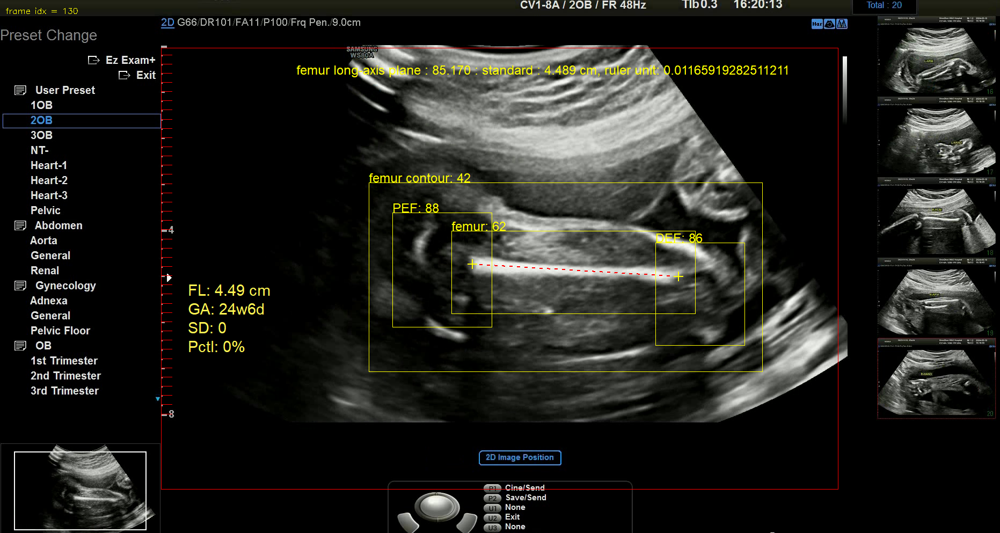

# Plug-and-play AI Measurements and Diagnosis Assistant in Prenatal Ultrasound

## 📌 Overview

This repository contains an AI-powered assistant for automated fetal biometry measurement and abnormality detection in prenatal ultrasound examinations. The system helps address critical challenges in prenatal care by:

- Reducing operator variability in measurements
- Improving diagnostic accuracy for fetal abnormalities
- Providing standardized assessments comparable to senior sonographers
  <!-- 本地图片示例 -->

## ✨ Key Features

### 📏 Automated Biometric Measurements
Accurately measures 7 key fetal growth parameters:
- Head Circumference (HC)
- Biparietal Diameter (BPD)
- Transverse Cerebellar Diameter (TCD)
- Femur Length (FL)
- Humerus Length (HL)
- Abdominal Circumference (AC)
- Lateral Ventricular Width (LVW)

### 🚨 Abnormality Detection
Real-time diagnosis of 6 clinically significant conditions:
- Intrauterine Growth Restriction (IUGR)
- Microcephaly (Micro)
- Skeletal Dysplasia (SD)
- Hydrocephalus (Hyd)
- Congenital Heart defects (CH)
- Other fetal malformations

### 🏥 Clinical Integration
- Plug-and-play solution requiring no hardware modifications
- Seamless integration with existing PACS systems
- Real-time feedback during ultrasound examinations

## 📊 Performance Highlights
- **Strong agreement** with senior sonographers (ICC: 0.60-0.96 across parameters)
- **High diagnostic accuracy**: 84.44%-100% for abnormalities in external validation
- **Validated** in multi-center study with:
  - 45,117 training cases
  - 1,200 real-time scans
  - 4,396 retrospective cases

## Installation

### Prerequisites

- Python ≥ 3.6
- numpy>=1.17.2
- opencv-python>=4.2.0.34
- pynetdicom>=2.4.0
- PySide6
- pywin32
- loguru>=0.6.0
- pandas>=1.4.2
- scikit-learn>=1.4.0
- torch>=2.2.0
- torchvision>=0.17.0
- mmdet>=3.3.0
- mmcv>=2.1.0
- timm>=0.9.0
- imgaug>=0.4.0
- yacs>=0.1.8
### Install python env

To install required dependencies on the virtual environment of the python (e.g., virtualenv for python3), please run the following command at the root of this code:
```
$ python3 -m venv /path/to/new/virtual/environment/.
$ source /path/to/new/virtual/environment/bin/activate
```
For example:
```
$ mkdir python_env
$ python3 -m venv python_env/
$ source python_env/bin/activate
```
 

### Build Detectron2 from Source

Follow the [INSTALL.md](https://github.com/facebookresearch/detectron2/blob/master/INSTALL.md) to install Detectron2.

## Dataset weight

We currently release partial pre-trained weights for academic research purposes only.
Available weights are placed in the folder: `./capture_core/model_config/deep_models`

The remaining weights will be released gradually in future updates.


## Testing

- Run `detection_test.py` to **automatically detect the target section and key fetal anatomical structures** in ultrasound images/videos.
- Run `measure_test.py` to **measure standard fetal growth parameters (e.g., femur length)**.

The testing pipeline supports three types of input data:
- Single ultrasound image
- Folder containing multiple ultrasound images
- Ultrasound scan video


Visualized results are available for images and videos, as shown below:

**Graphical Annotation**:
- ROI bounding box
- Ruler scale
- Bounding boxes of key anatomical structures
- Measurement line segments for fetal growth parameters

**Text Information**:
- Frame number
- Section type
- Section score
- Standard section judgment
- Ruler unit value
- Estimated fetal gestational age



After running the video, a **JSON format file** will be automatically saved to record structural information and measurement details, as follows:

```json
{
  "config": {},
  "annotations": {
    "0": {
      "plane_type": "other",
      "class_score": 0.0,
      "std_type": "nonstandard"
    },
    ...,
    "11": {
      "plane_type": "femur long-axis plane",
      "class_score": 0.0,
      "std_type": "standard",
      "seg_roi": [507, 387, 913, 404],
      "new_or_update_mode": -1,
      "score": 85.86,
      "confidence": 77.87,
      "annotations": [
        {
          "type": "rect",
          "name": "femur",
          "score": 0.7018252611160278,
          "vertex": [[742.0, 511.0], [1206.0, 660.0]]
        },
        {
          "type": "rect",
          "name": "PEF",
          "score": 0.8579984307289124,
          "vertex": [[620.0, 464.0], [813.0, 676.0]]
        },
        {
          "type": "rect",
          "name": "DEF",
          "score": 0.8737602233886719,
          "vertex": [[1136.0, 527.0], [1308.0, 731.0]]
        },
        {
          "type": "rect",
          "name": "femur contour",
          "score": 0.32234349846839905,
          "vertex": [[583.0, 420.0], [1344.0, 758.0]]
        }
      ],
      "measure_results": {
        "type": "fl",
        "vertex": [[784.3385118063063, 573.4413163662662], [1169.2899037613524, 580.254966773534]],
        "measure_fl": 4.48993222314017,
        "ruler_info": {
          "startX": 300,
          "endX": 300,
          "startY": 130,
          "endY": 816,
          "count": 40,
          "rulerUnit": 0.011661807580174927
        }
      }
    },
    ...,
  }
}
```

## 📝 License

This project is licensed under the MIT License - see the [LICENSE](LICENSE) file for details.

## 🙏 Acknowledgments

We thank the participating hospitals and sonographers who contributed data and expertise to this project.

## Code Reference 
  - [detectron2](https://github.com/facebookresearch/detectron2)
  - [YOLO](https://github.com/ultralytics/yolov5)
